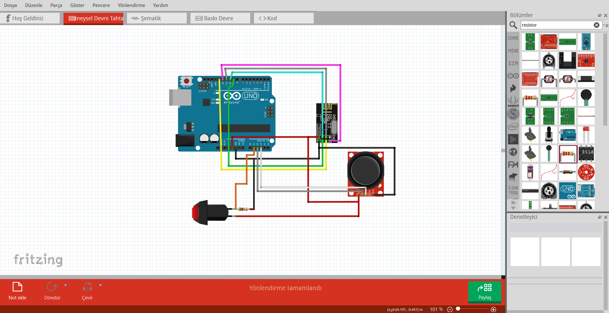
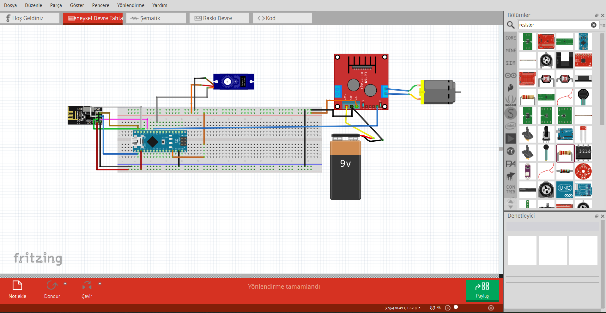

# NRF24L01-Uzaktan-kontrol-sistemi
Projede NRF24L01 modülü ile uzaktan kontrollü iha, araba ya da tekne kontrölü sağlayacak, arduino tabanlı bir sistem yapmayı hedefledim.
PROJEYİ ÇALIŞTIRDIĞIM VİDEO LİNKİ=>
https://youtu.be/bdaZu6aJk-I

 Arduinonun analog pinlerinden aldığımız joystick ve buton sinyallerini NRF ile alıcı devreye aktarıyoruz.

Verici devreden aldığımız verilerin içeriğine göre servo motor ve dc motorun kontrolünü sağlıyoruz. Bu kontrolleri sağlarken servo motorun sinyal kablosunu arduinonun herhangi bir pwm pinine; dc motor kontrolünü sağladığımız l298n modülündeki in1 pinini de arduinonun herhangi bir dijital pinine bağlıyoruz.